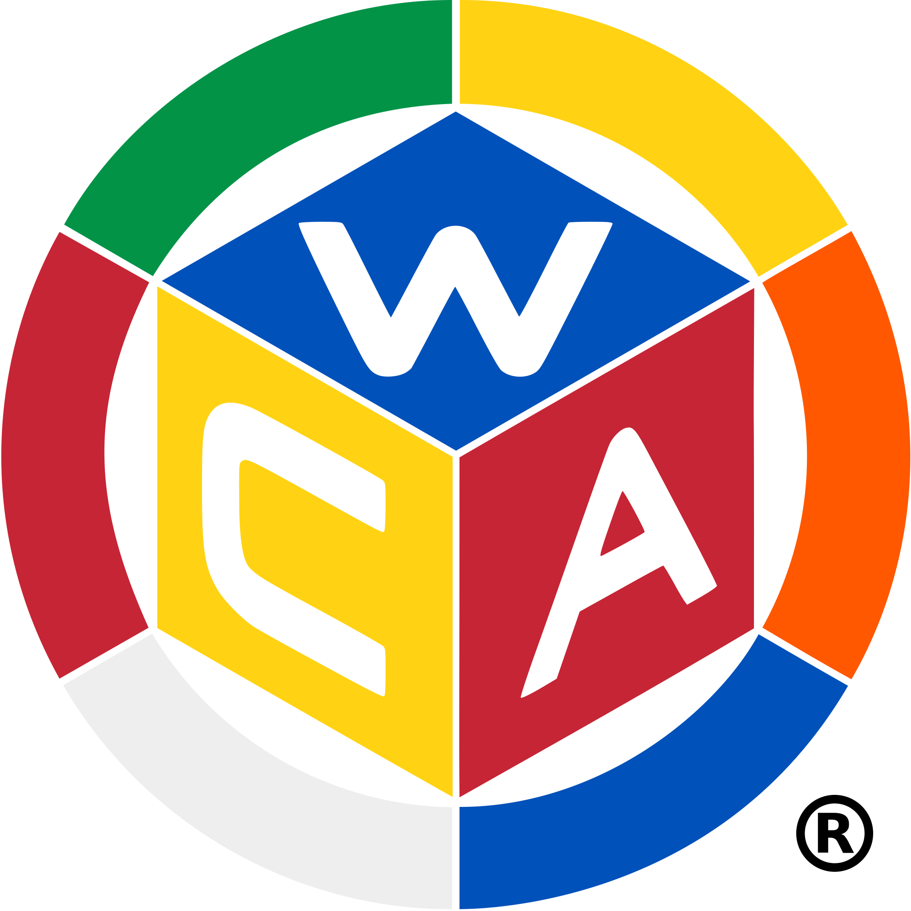

  

  <h1>WCA 查询</h1>

  

    基于 AstrBot 的 WCA / ONE 成绩查询插件，基于 API 实时查询、对比 
  

  

    
    
    
  

---

## 功能

- **成绩查询**：查询 WCA 官方成绩、one 平台成绩，并可生成 WCA 个人成绩图
- **成绩对比**：支持 WCA PK、one PK、同一选手 WCA/one 双平台对比、双平台 PR 与 PRPK
- **绑定识别**：支持 QQ 绑定 WCAID / oneID，常用查询与 PK 命令可自动识别发送者或被艾特用户
- **辅助查询**：支持宿敌统计、宿敌数据库版本查询、近期中国 WCA 比赛查询

## 指令

| 命令 | 描述 | 示例 |
|------|------|------|
| `/cube帮助` | 展示所有命令 | `/cube帮助` |
| `/wca` | 查询 wca 个人记录| `/wca 2026ZHANG01` |
| `/one` | 查询 one 平台个人记录 | `/one`、`/one @某人`、`/one 1234` |
| `/wcapic` | 生成个人最佳记录图片 | `/wcapic`、`/wcapic @某人`、`/wcapic 张伟` |
| `/wcapk` | 比较两位选手的 wca 成绩 | `/wcapk @某人`、`/wcapk @甲 @乙`、`/wcapk 张伟 李华` |
| `/onepk` | 比较两位选手的 one 成绩 | `/onepk @某人`、`/onepk @甲 @乙`、`/onepk 张伟 李华` |
| `/pktwo` | 比较同一选手在 WCA 与 one 两个平台的成绩 | `/pktwo 2026ZHANG01 1234` |
| `/pr` | 查询双平台 PR；同名可手动指定 WCAID/oneID | `/pr`、`/pr @某人`、`/pr 2026ZHANG01 1234` |
| `/prpk` | 比较两位选手的双平台 PR 成绩；同名可手动指定双方 WCAID/oneID | `/prpk @某人`、`/prpk @甲 @乙`、`/prpk 李华 张伟` |
| `/wca绑定` | 将当前 QQ 和 WCAID 绑定 | `/wca绑定 2026ZHANG01` |
| `/one绑定` | 将当前 QQ 和 oneID 绑定 | `/one绑定 1234` |
| `/宿敌` | 查询宿敌 | `/宿敌`、`/宿敌 @某人`、`/宿敌 2026ZHANG01` |
| `/版本` | 查询宿敌后端当前数据库导出日期 | `/版本` |
| `/近期比赛` | 查询近期在中国举办的 WCA 比赛 | `/近期比赛` |

## 外部依赖

- WCA 官方 API、one 平台 API、宿敌接口 `wca.huizhi.pro`、cubing.com 近期比赛接口

## 绑定说明

- `/wca绑定 <WCAID或姓名>` 绑定当前 QQ 与 WCA 选手；`/one绑定 <oneID或用户名>` 绑定当前 QQ 与 one 用户。
- 单人命令支持自查与艾特查询：`/wca`、`/wcapic`、`/宿敌`、`/one`、`/pr` 可直接使用绑定；带 `@某人` 时查询对方绑定信息。
- 双人命令支持艾特 PK：`/wcapk`、`/onepk`、`/prpk` 只艾特一个人时默认“自己 vs 对方”，艾特两个人时比较这两个被艾特用户。
- 双平台命令 `/pr`、`/prpk` 要求目标用户同时绑定 WCAID 与 oneID。
- 绑定信息保存在插件数据目录下的 `wca_bindings.json` 和 `one_bindings.json`。

---

## 更新日志

查看历史版本

### v1.1.11

- `/cube帮助`、`/wcapic`、`/onepk`、`/pktwo`、`/版本` 接入命令接收后的轻量表情反馈
- 配置说明同步补充当前会使用即时反馈的命令范围

### v1.1.10

- `/prpk` 支持一个非发送者艾特时自动进行“发送者 vs 被艾特者”的双平台 PRPK 对比
- `/prpk` 支持两个艾特对象直接对比，要求双方都同时绑定 WCAID 与 oneID

### v1.1.9

- `/pr` 支持无参数自查，自动使用当前 QQ 的 WCAID 与 oneID 绑定
- `/pr @某人` 支持查询被艾特用户的双平台 PR，要求对方同时绑定 WCAID 与 oneID

### v1.1.8

- 新增 `/one绑定` 指令，支持将 QQ 绑定到 one 平台用户
- `/one` 支持通过发送者绑定或艾特对象绑定自动识别 one 用户
- `/onepk` 支持一个非发送者艾特时自动进行“发送者 vs 被艾特者”对比，也支持两个艾特对象直接对比

### v1.1.7

- `/wcapic`、`/宿敌` 支持像 `/wca` 一样通过发送者绑定或艾特对象绑定自动识别 WCA 选手
- `/wcapk` 支持一个非发送者艾特时自动进行“发送者 vs 被艾特者”对比，也支持两个艾特对象直接对比

### v1.1.6

- 修复 `/pr` 与 `/prpk` 跨平台合并成绩中金字塔和斜转项目映射反转的问题
- `/wcapic` 与 `/cube帮助` 改为 Pillow 本地绘制，移除对 HTML 截图渲染链的依赖
- 内置中文字体切换为 `NotoSansSC-Regular`

### v1.1.5

- 新增 `/onepk` 指令，支持用 one 用户名或 oneID 对比两位选手的单次与平均成绩
- `/cube帮助` 与 README 同步补充 `/onepk` 说明
- 适配 one 平台项目描述改为中文后的跨平台映射逻辑，修复 `/pr`、`/prpk`、`/onepk` 的项目归一化兼容性

### v1.1.4

- 将“命令收到后的表情”收为可配置项
- 新增 `enable_command_reaction` 与 `command_reaction_emoji_id` 插件配置
- 相关即时反馈统一改为读取共享配置，后续切换表情无需改代码

### v1.1.3

- `/wcapk`、`/pr`、`/prpk`、`/宿敌`、`/近期比赛` 的“查询中”即时反馈改为轻量表情反馈
- 优先在 `aiocqhttp` / QQ 环境下使用原生消息贴表情，减少额外文字提示刷屏

### v1.1.2

- 调整 `/wca` 个人记录文本中的排名展示规则
- 中国选手继续仅显示 `NR<=200`
- 非中国选手改为按 `WR`、`CR`、`NR` 的优先级显示，且仅在排名 `<=100` 时返回
- 当 `WR/CR/NR` 排名为 `1` 时，仅显示前缀，不再附带数字

### v1.1.1

- 重新整理插件目录结构，顶层仅保留 `main.py` 与文档/元数据文件
- 将代码按 `clients/`、`core/`、`services/` 分层，静态资源按 `templates/`、`assets/` 分类
- 清理旧的顶层散落模块路径，降低后续维护与定位成本

### v1.1.0

- 新增 one 平台客户端、跨平台比较服务和帮助页渲染模板
- 插件定位升级为 WCA + one 成绩工具集，主入口统一管理相关查询命令

### v1.0.11

- 抽出公共格式化模块，统一承载项目映射、时间格式化、多盲格式化与文字成绩排版
- `wca_pic`、`wcapk`、`wca_query` 不再直接共享同一个大文件内的格式化实现，依赖关系更清晰
- `wca_query.py` 进一步收敛到查询与命令处理职责，便于后续继续拆分记录构建逻辑

### v1.0.10

- 抽出公共选手查找模块，统一复用搜索、唯一选手解析与多结果提示逻辑
- `/wca`、`/wcapic`、`/宿敌`、`/wca绑定`、`/wcapk` 现共用同一套选手匹配规则
- 继续收敛重复代码，为后续拆分文本格式化和记录查询流程打基础

### v1.0.9

- 将宿敌与版本查询服务拆分到独立模块，降低 `wca_query.py` 的职责耦合
- 将图片卡片 HTML 模板与模板数据构建逻辑拆出，`wca_pic.py` 仅保留命令流程与发送逻辑
- 为后续继续拆分渲染、查询与格式化能力预留更清晰的模块边界

### v1.0.8

- 宿敌查询适配新的后端接口返回语义
- 新增 `/版本` 指令，用于查询宿敌后端当前数据库导出日期
- 补强宿敌与版本接口的非 200 响应日志，便于排查后端异常

### v1.0.7

- 新增 `/wca绑定` 指令，支持将当前 QQ 绑定到 WCAID 或唯一姓名
- `/wca` 现已支持绑定后免参数查询自己，也支持通过 `@` 已绑定用户直接查询
- 新增绑定数据持久化与自动清洗逻辑，绑定信息保存到 `wca_bindings.json`

### v1.0.6

- 新增 `/wcapic` 指令，生成个人最佳记录图片卡片
- 命令主流程拆分到各自模块，main.py 仅保留注册与分发
- 查询体验优化（风格更卡哇伊），错误提示更友好

### v1.0.5

- **全新架构**：采用全 API 调用架构，移除本地数据库依赖，所有数据查询均通过 WCA 官方 API 和第三方 API 实现
- **轻量化设计**：无需下载和维护本地 TSV 文件，无需 SQLite 数据库，插件体积更小，启动更快
- **实时数据**：所有查询均实时获取最新数据，无需等待数据库更新周期
- **宿敌查询优化**：宿敌查询功能改为调用外部 API 服务，提供更稳定的查询体验

### v1.0.4

- **WCA v2 数据库适配**：适配 WCA 官方 v2 导出格式，支持新的 snake_case 表名和字段名（如 `persons.wca_id`、`persons.country_id` 等）
- **近期比赛功能**：新增 `/近期比赛` 命令，通过 cubing.com API 获取近期在中国举办的 WCA 比赛列表，显示中文比赛名称和地点信息

### v1.0.3

- 修复宿敌查询条件判断的 bug

### v1.0.2

- 修复宿敌查询中洲人数和世界人数一致的 bug
- 数据库存储路径规范为 `data/plugin_data/astrbot_plugin_wca/`

### v1.0.1

- **数据持久化改进**：使用 `StarTools.get_data_dir()` 将数据文件存储在规范的 `data/plugin_data/wca/` 目录，而不是插件源代码目录
- **性能优化**：使用 `asyncio.to_thread()` 将 TSV 处理操作放入线程池执行，避免阻塞主事件循环
- **代码重构**：将 `process_tsv_to_sqlite()` 方法拆分为多个专用辅助函数，提高代码可读性和可维护性
- **宿敌查询**：新增了宿敌查询功能

### v1.0.0

- 初始版本

